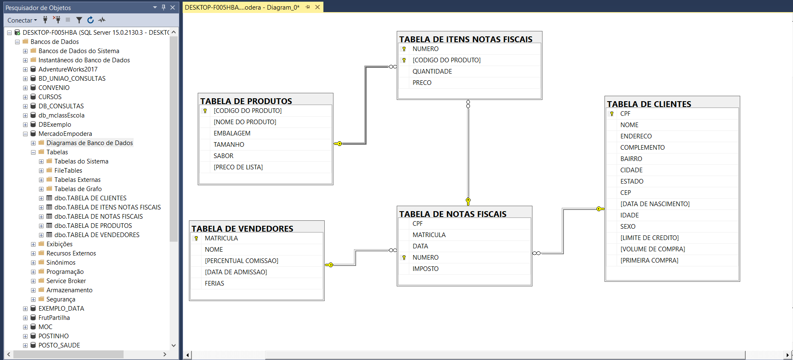
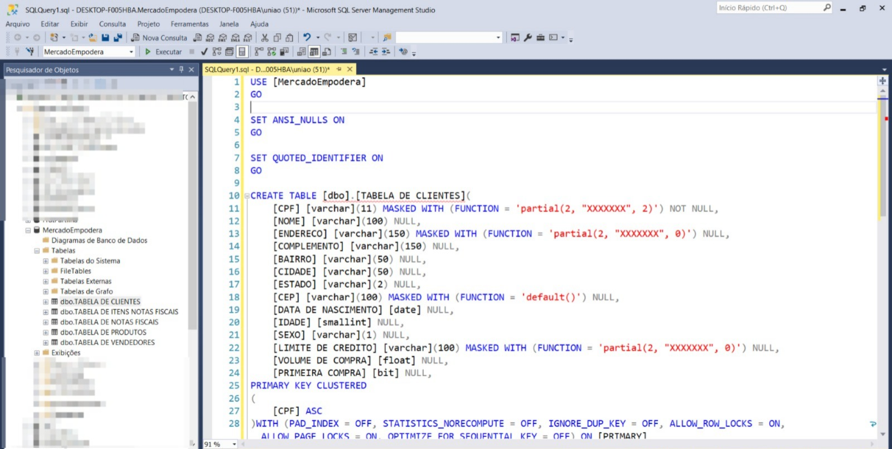
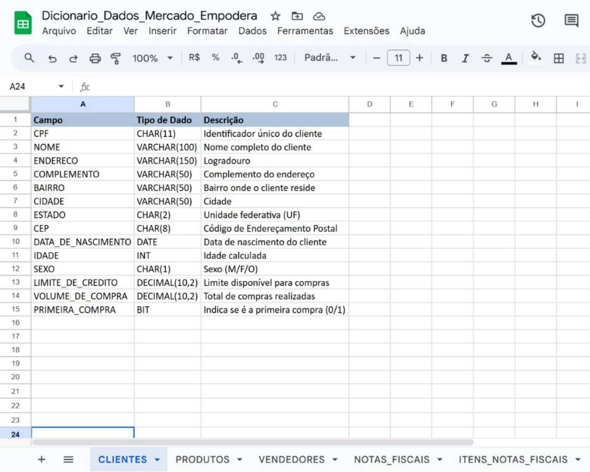
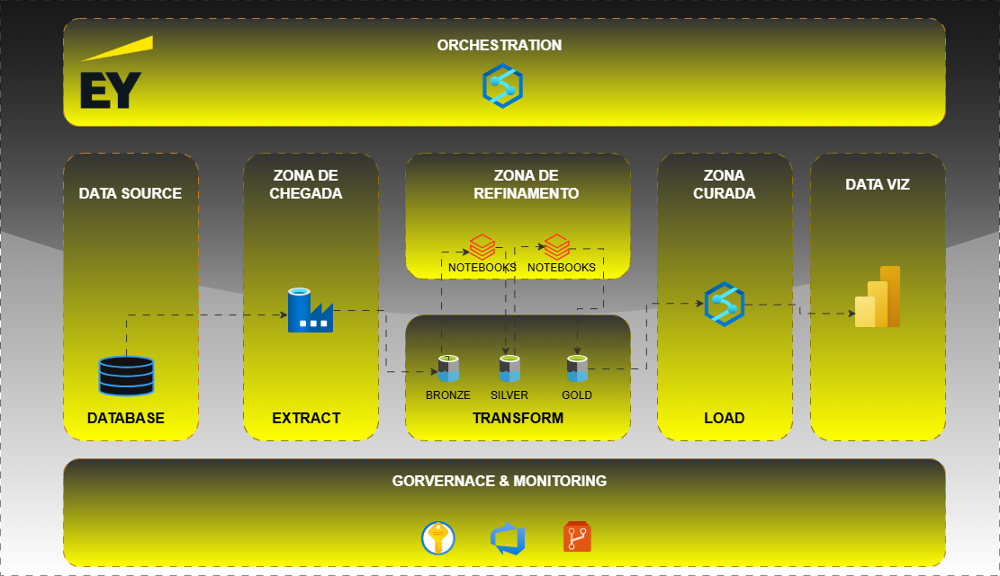
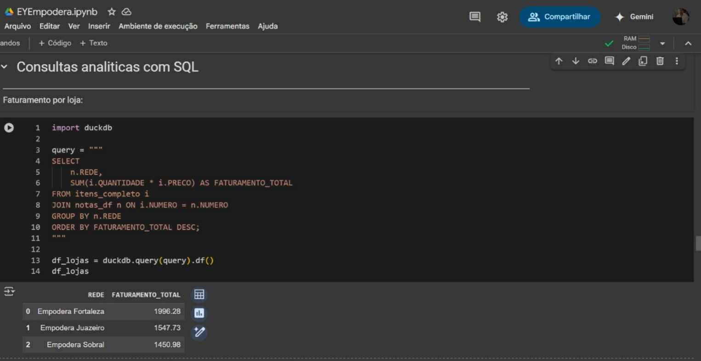
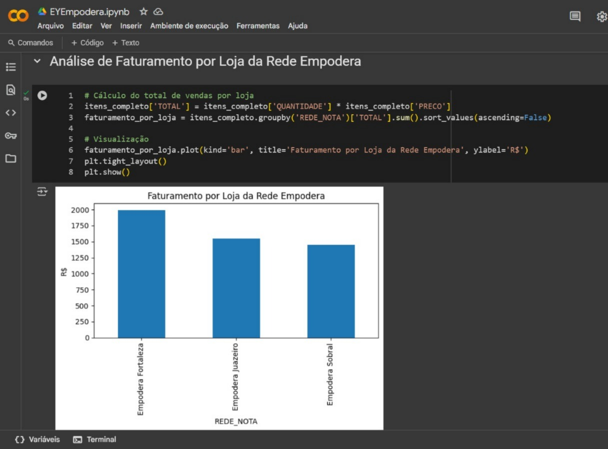
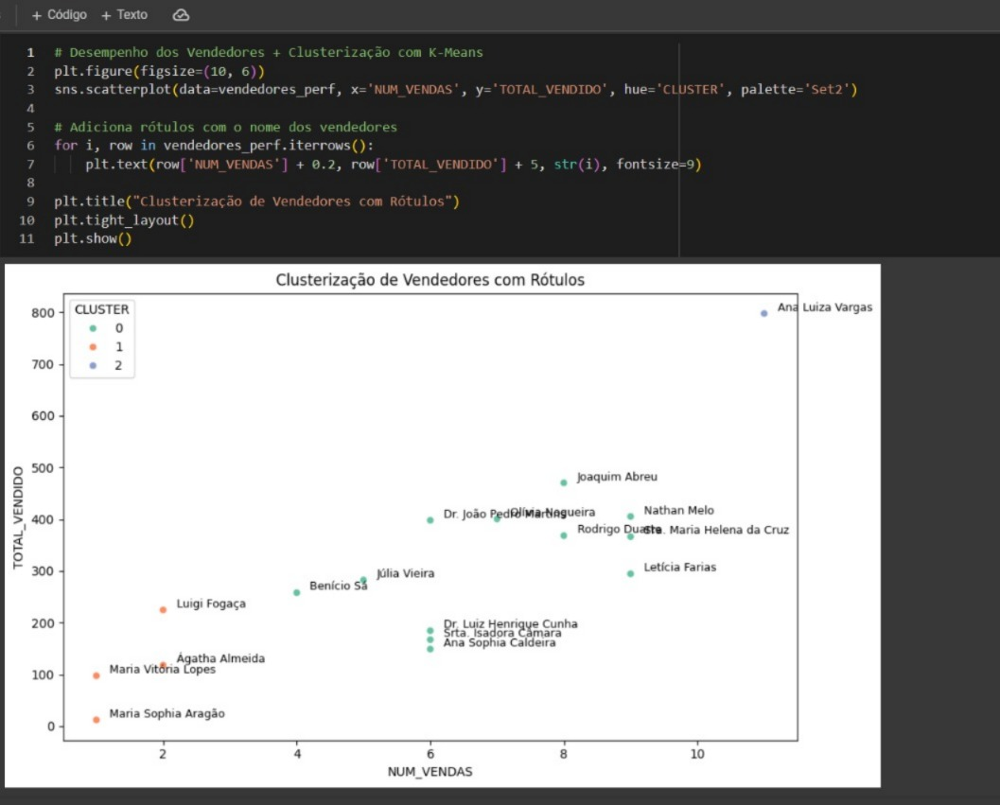

# EYEmpodera
# 🛒 Projeto Mercado Empodera – Análise de Dados e Arquitetura de Soluções

Este projeto foi desenvolvido como forma de **colocar em prática todo o conhecimento adquirido no programa EYEmpodera**, que abordou desde competências técnicas até habilidades de desenvolvimento pessoal e profissional. A iniciativa simula a construção de um mercado fictício chamado **Empodera**, abrangendo desde a definição do modelo de negócio até a análise de dados com visualização em dashboards.

## 🌟 Competências Aplicadas

Durante o desenvolvimento deste projeto, foram aplicados aprendizados nas seguintes áreas:

- **Engenharia e Governança de Dados**
- **Arquitetura de ETL na Azure (Data Factory, Delta Lake, Camadas Bronze/Silver/Gold)**
- **Modelagem de Dados (MER e Físico no SQL Server)**
- **Lógica de Programação e Python**
- **Estatística Aplicada**
- **Análises de Negócios**
- **Power BI para Visualização de Dados**
- **GitHub para Versionamento**
- **Mentalidade de Crescimento, Marca Pessoal e Carreira**
- **Automação Inteligente e Cultura Agile/DevOps**

## 🧱 Etapas do Projeto

### 1. 📈 Definição do modelo de negócio
O ponto de partida do projeto foi a criação de um modelo de negócio para um supermercado fictício, o Mercado Empodera, com o objetivo de simular operações reais de varejo. Essa simulação permitiu estruturar uma base sólida de dados, considerando processos operacionais, comerciais e estratégicos.

- Foram definidos os principais elementos que compõem a jornada de compra e gestão de um supermercado:

- Clientes: identificação de perfis de consumo, frequência de compras e ticket médio.

- Produtos: cadastro de itens comercializados com categorias, preços e status de estoque.

- Vendas: simulação de notas fiscais com data, horário, forma de pagamento e valor total.

- Itens de venda: detalhamento dos produtos vendidos por nota fiscal.

- Vendedores: registro de colaboradores responsáveis pelas vendas, com foco em performance.

Essa etapa foi essencial para garantir que a estrutura de dados refletisse os processos de negócio, possibilitando análises assertivas e visualizações estratégicas posteriormente. Além disso, contribuiu para a construção do modelo relacional e definição da arquitetura de dados adotada.
--
### 2. 📘 Modelagem Entidade-Relacionamento (MER)
Nesta etapa do projeto, foi realizada a modelagem lógica e física do banco de dados que representa o funcionamento do Mercado Empodera, com foco em refletir fielmente as regras de negócio de um supermercado.
Através da técnica de modelagem entidade-relacionamento (MER), foram definidos os principais componentes do sistema e suas interações, visando garantir consistência, integridade referencial e escalabilidade dos dados.

As tabelas principais criadas foram:

> Clientes: contendo informações como CPF, nome, idade, sexo, endereço e volume de compras.

> Produtos: com dados sobre código, nome, embalagem, tamanho, sabor e preço de lista.

> Notas Fiscais: registrando as compras realizadas, associadas a clientes e vendedores.

> Itens de Notas Fiscais: detalhando os produtos vendidos em cada nota com quantidade e valor unitário.

> Vendedores: com informações como matrícula, nome, percentual de comissão e data de admissão.

O banco de dados foi implementado no SQL Server, com as devidas chaves primárias, estrangeiras e relacionamentos normalizados. Esse modelo possibilita análises complexas de performance de vendas, comportamento de compra dos clientes e eficiência da equipe comercial.

--
### 3. 🧩 Criação do banco de dados no SQL Server
Com base no modelo entidade-relacionamento (MER) definido, foi realizada a implementação do banco de dados relacional no SQL Server para dar suporte ao funcionamento do projeto Mercado Empodera.
As principais etapas desta fase foram:

- Criação do banco de dados MercadoEmpodera.
- Implementação das tabelas com base no modelo físico: Clientes, Produtos, NotasFiscais, ItensNotasFiscais e Vendedores.
- Definição de chaves primárias e estrangeiras para garantir integridade referencial entre as tabelas.
- Criação de relacionamentos entre os dados, refletindo a estrutura de um sistema de vendas real.
- Inserção de dados simulados nas tabelas, com base em cenários verossímeis de um supermercado:
- Clientes com diferentes perfis de consumo e localização.
- Produtos de diversas categorias com variações de tamanho e sabor.
- Vendedores com diferentes níveis de comissão.
- Notas fiscais simulando o histórico de compras.
- Itens das notas detalhando os produtos vendidos.

Dicionário de Dados das tabelas do projeto Mercado Empodera, com os principais atributos e descrições de cada campo:

Esta etapa garante a base sólida para as etapas seguintes de ETL, análises e visualização, assegurando que os dados estejam bem estruturados e prontos para processamento.

### 4. ☁️ Arquitetura de Dados na Azure EY
Uma arquitetura de dados moderna baseada em soluções Microsoft Azure, utilizada no projeto da rede de supermercado Empodera. A estrutura segue as boas práticas de Data Lakehouse com camadas Bronze, Silver e Gold, além de ferramentas para orquestração, governança e visualização. Abaixo está uma análise por bloco da arquitetura:

--
- ### 1. ORCHESTRATION
Ferramenta: Azure Data Factory (ícone presente)

Função: Controlar o fluxo de execução dos processos de ETL/ELT, desde a extração até a carga final nos dashboards.

- ### 2. DATA SOURCE
Origem: Banco de Dados (SQL Server ou outro relacional)

Função: Sistema transacional que armazena os dados brutos dos processos operacionais (clientes, produtos, vendas, etc.).

- ### 3. ZONA DE CHEGADA (Landing Zone)
Ação: Extract

Função: Captura e armazena os dados brutos extraídos do banco. Representa a entrada no Data Lake (camada Bronze).

- ### 4. ZONA DE REFINAMENTO
Ferramenta: Notebooks (Databricks ou Synapse)

Função: Aplicar limpeza, enriquecimento e transformação de dados entre as camadas:

Bronze: dados brutos

Silver: dados limpos e padronizados

Gold: dados prontos para análise e negócio

- ### 5. ZONA CURADA
Ação: Load

Ferramenta: Azure Data Factory

Função: Enviar os dados da camada Gold para o ambiente de consumo.

- ### 6. DATA VIZ
Ferramenta: Power BI

Função: Visualização dos dados curados para geração de relatórios, dashboards e insights.

- ### 7. GOVERNANCE & MONITORING
Recursos representados:

Segurança e controle de acesso (chave)

Azure Monitor / Logs (ícone azul)

GitHub para versionamento de notebooks e infraestrutura

- ###  Boas Práticas Aplicadas
Arquitetura modular e escalável

Separação clara entre extração, transformação e carga

Uso de camadas do Delta Lake para rastreabilidade e versionamento

Integração de ferramentas como Azure Data Factory, Power BI e notebooks (provavelmente via Azure Databricks)

Preocupação com governança e monitoramento.
--
### 5. ⚙️ ETL e Consultas Analíticas
Nesta etapa, foram construídos pipelines de ETL para simular o fluxo de dados de um supermercado, desde a chegada até a análise final. As transformações foram feitas utilizando Python + SQL (DuckDB) em notebooks, com dados organizados em zonas:

Bronze (chegada): ingestão bruta dos dados simulados.

Silver (refinamento): tratamento e integração de dados de vendas, produtos, clientes e notas fiscais.

Gold (curada): preparação dos dados para análise e visualização.

- Exemplo de Consulta Analítica
A consulta a seguir demonstra o cálculo do faturamento total por loja, unindo tabelas de itens vendidos e notas fiscais:

> Essa análise exemplifica como o modelo permite consultas rápidas e eficientes diretamente sobre DataFrames em memória, oferecendo insights relevantes para o negócio.
--
### 6. 📊 Etapa de Analytics e Visualização
Nesta fase do projeto, os dados refinados foram utilizados para gerar insights analíticos através de visualizações com Python. As análises se concentraram em:

Faturamento total por loja

Produtos mais vendidos (em andamento ou próximos passos)

Exemplo: Faturamento por Loja da Rede Empodera
Com o uso de bibliotecas como pandas e matplotlib, foi possível calcular o total de vendas por loja, criando um gráfico de barras para facilitar a visualização dos resultados.

Gráfico gerado:
Empodera Fortaleza lidera o faturamento total.
Em seguida vêm Empodera Juazeiro e Empodera Sobral.
Esse tipo de visualização permite identificar rapidamente o desempenho financeiro de cada unidade da rede, sendo uma base importante para tomada de decisões estratégicas.

### - **Análise de Desempenho dos Vendedores (Clustering)**

Aplicamos o algoritmo **K-Means** com `n_clusters=3` para segmentar os vendedores com base em:

- `TOTAL_VENDIDO`: soma do valor total vendido.
- `NUM_VENDAS`: quantidade de vendas realizadas.

**Resultados da Clusterização**:
- **Cluster 0**: Baixo desempenho
- **Cluster 1**: Desempenho médio
- **Cluster 2**: Alto desempenho
Cada ponto do gráfico representa um vendedor e foi rotulado com seu **nome** para facilitar a identificação

## 📌 Conclusões

- É possível **identificar facilmente os vendedores de destaque**, como *Ana Luiza Vargas*, bem como aqueles que apresentam baixo desempenho.
- A clusterização mostra-se eficaz como ferramenta para **tomada de decisão gerencial**, como alocação de metas, premiações e treinamentos.
- A estrutura dos dados permite expansões futuras com análises por loja, perfil de cliente ou mix de produtos.

- Perfil dos clientes e frequência de compra
--
## 🛠️ Tecnologias Utilizadas

- **SQL Server**
- **Python (Pandas, PySpark)**
- **Azure Data Factory**
- **Azure Data Lake / Delta Lake**
- **Power BI**
- **Git & GitHub**
- **Excel (auxiliar na análise)**
- **Matplotlib / Seaborn** – Visualizações gráficas.
- **Scikit-learn** – Algoritmos de machine learning.
- **Google Colab** – Ambiente computacional usado para o desenvolvimento e execução do projeto.

## 📌 Conclusão

Este projeto representa uma jornada completa desde a concepção até a entrega de valor via dados, consolidando os pilares desenvolvidos no EYEmpodera. Mais do que um exercício técnico, é um reflexo da minha **mentalidade de crescimento**, **visão analítica** e capacidade de **resolver problemas com propósito**.
